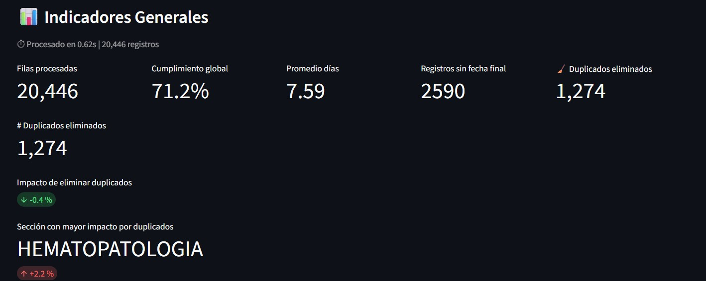
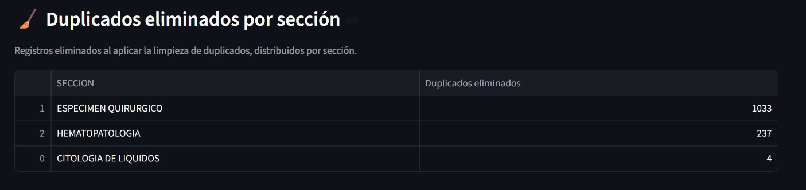

# 📊 Dashboard Analítico de Días Laborales

Dashboard interactivo desarrollado en Python y Streamlit para el análisis de tiempos operativos y cumplimiento de SLA, considerando festivos, fines de semana y reglas de negocio por sección.

## 🚀 Tecnologías
- Python
- Streamlit
- Pandas / NumPy
- Altair
- Excel


## 📸 Capturas de la aplicación

### Indicadores y gráfico principal


### Duplicados eliminados por sección


## 🧪 Tests
El proyecto incluye tests unitarios con pytest para:
- Limpieza de fechas
- Reglas de negocio
- Procesamiento de datos

Ejecutar:
```bash
pytest

## ⚙️ Ejecución local
```bash
pip install -r requirements.txt
streamlit run app.py

